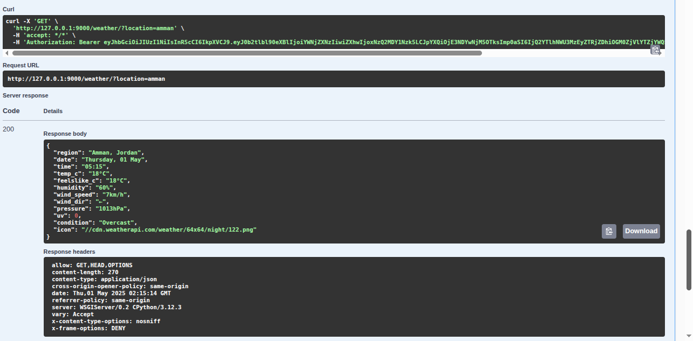
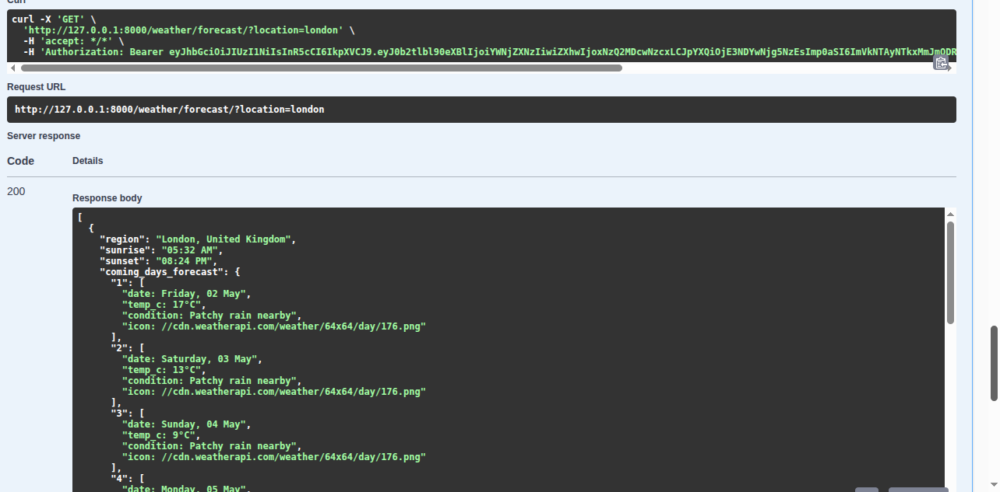

## sky_pulse

**A Django REST API for fetching real-time weather information and multi-day forecasts based on a provided city or country.**

---

### Table of Contents

- [Features](#features)
- [Tech Stack](#tech-stack)
- [Getting Started](#getting-started)
  - [Installation](#installation)
  - [Running the Application](#running-the-application)
- [API Endpoints](#api-endpoints)
- [Usage Examples](#usage-examples)
- [Screenshots](#screenshots)

---

## Features

- User authentication with JSON Web Tokens (JWT)
- Retrieve current weather by location
- Retrieve 5-day forecast and hourly forecast
- Automatic fallback to client IP-based location lookup
- Interactive API documentation via Swagger/OpenAPI

## Tech Stack

- **Framework:** Django 5.1, Django REST Framework
- **Authentication:** djangorestframework-simplejwt
- **Schema & Docs:** drf-spectacular (OpenAPI + Swagger UI)
- **Weather Data:** weatherapi.com (live), ipinfo.io for geo-lookup
- **Database:** SQLite (default)

## Getting Started

### Installation

1. **Clone the repository**:

```bash
git clone https://github.com/Ahmed-zoubii/sky-pulse.git
cd sky-pulse
```

2. **Create & activate a virtual environment**:

    ```bash
    python3 -m venv venv
    ```

    #### For macOS/Linux:

    ```bash
    source venv/bin/activate
    ```

    #### For Windows:

    ```bash
    venv\Scripts\activate
    ```

3. **Install dependencies**:

```bash
pip install -r requirements.txt
```

### Running the Application

1. **Apply migrations**:

```bash
python3 manage.py migrate
```

2. **Create a superuser** (for Django admin, optional):

```bash
python3 manage.py createsuperuser
```

3. **Run the development server**:

```bash
python3 manage.py runserver
```

4. **Browse API docs**:  
   [http://localhost:8000/api-docs/swagger-ui/](http://localhost:8000/api-docs/swagger-ui/)

## API Endpoints

| Method | Endpoint                                | Description                                        |
| ------ | --------------------------------------- |----------------------------------------------------|
| POST   | `/accounts/login/`                      | Obtain JWT access & refresh tokens                 |
| POST   | `/accounts/refresh/`                    | Refresh JWT access token                           |
| GET    | `/weather/?location=City`               | Current weather for `City` (auth required)         |
| GET    | `/weather/forecast/?location=City`      | 5-day & hourly forecast for `City` (auth required) |

_All weather endpoints require an `Authorization: Bearer <access_token>` header._

## Usage Examples

1. **Login to get tokens** ([http://localhost:8000/accounts/login/](http://localhost:8000/accounts/login/)):

```bash
curl -X POST http://localhost:8000/accounts/login/ \
  -H "Content-Type: application/json" \
  -d '{"username": "user", "password": "pass"}'
```

2. **Take the `access` token from the response**, then open your browser and go to:  
   [http://localhost:8000/api-docs/swagger-ui/](http://localhost:8000/api-docs/swagger-ui/)

3. **Authorize Swagger UI**:
   - Click on the **"Authorize"** button at the top right.
   - Paste your access token into the input box.
   - Click **"Authorize"** again and close the dialog.

4. **Test the Weather APIs**:
   - Scroll down to the `/weather/` and `/weather/forecast/` sections.
   - Click **"Try it out"**, enter a city name (e.g., `Amman`), and execute the request.

## Screenshots

### Current Weather Example


### Forecast Example

